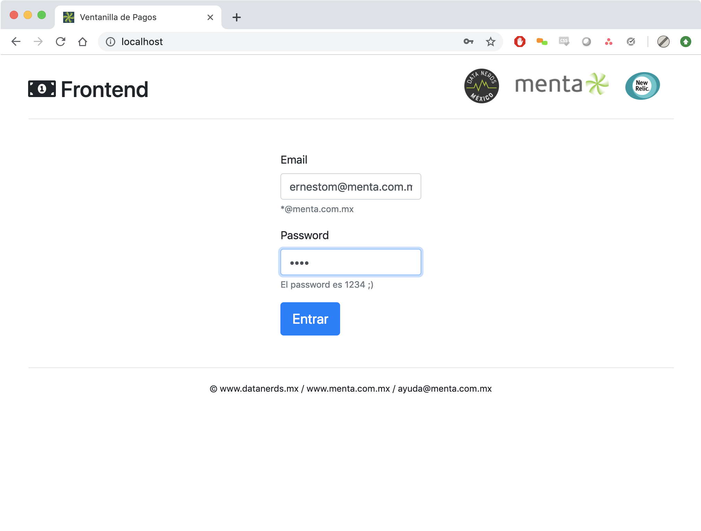

**Sample Electronic Payments platform running on microservices with Java, .Net Core, Python, Node.js, Oracle, and MySQL.**

[](https://www.menta.com.mx)

Mas información en el canal de Slack de [DataNerdsMX](https://www.datanerds.mx) o en ayuda@menta.com.mx.

## Servicios

| Servicio | URL | Tecnologías | Archivo principal |
|-|-|-|-|
| Frontend | http://localhost/ | Python, Flask, UWSGI, Supervisord | [services/frontend/source/app.py](services/frontend/source/app.py) |
| API | http://localhost:8000/ | Node.js, Express | [services/api/source/app.js](services/api/source/app.js) |
| Antifraude | http://localhost:8080/risk-assessment-service | Java, Tomcat, Servlet | [services/antifraud/source/src/.../RiskAssessmentServlet.java](services/antifraud/source/src/main/java/mx/menta/demotren/RiskAssessmentServlet.java) |
| Core | http://localhost:5000/core/PaymentProcessor | .Net Core | [services/core/source/Controllers/PaymentProcessorController.cs](services/core/source/Controllers/PaymentProcessorController.cs) |


## Arquitectura


## Flujo

### Instalación

Requisitos:

- Una cuenta de New Relic con APM Pro
- Docker
- GNU Make

Renombrar el archivo [.env.dist](./.env.dist) por `.env` y definir el valor de `NEW_RELIC_LICENSE_KEY` con una llave de licencia válida.


### Arranque

Para arrancar todos los servicios es necesario ejecutar el comando `make run` dentro de la raíz del repositorio.
Este comando ejecutará el comando `make run` de cada servicio dentro de su directorio correspondiente.

Los servicios se arrancarán con base en la especificación del archivo [docker-compose.yml](docker-compose.yml).

Se puede generar tráfico en la plataforma con el comando `bash load.sh`.

### Casos de uso


1. Entrar al frontend [http:localhost/](http:localhost/)
2. Login usando un email con terminación `@menta.com.mx` y password `1234`

3. Hacer un pago desde la ventanilla (Crear intención de pago)


## En New Relic

### Custom Events

| Servicio | Custom Event |
| - | - |
| API | PaymentIntent |
| Antifraude | AntifraudRiskAssessmentEvaluation |
| Core | AuthorizerResponse |

### Custom Attributes

| Servicio | Transacción | Custom Attributes |
| - | - | - |
| Frontend | / | FormWasFilled, ValidLogin, BannedDomain, Email |
| API | /status/{transactionId} | status, transactionId |
| Antifraude | /risk-assessment-service/evaluate-payment-intent | transactionId, token, amount, riskScore, delay, status |
| Core | /core/PaymentProcessor | authorizer, status, delay |

### Tableros

Con los Custom Attributes y Custom Events anteriores, se puede obtener una perspectiva clara de cómo funciona la plataforma.


Consultas NRQL del tablero anterior:

```
SELECT count(*) FROM PaymentIntent FACET message TIMESERIES SINCE 5 minutes ago
SELECT count(*) FROM PaymentIntent FACET message
SELECT count(*) FROM PaymentIntent FACET status
SELECT count(*) FROM AntifraudRiskAssessmentEvaluation FACET status
SELECT histogram(riskScore,10,10) FROM AntifraudRiskAssessmentEvaluation FACET amount limit 30
SELECT average(delay) FROM AntifraudRiskAssessmentEvaluation  TIMESERIES
SELECT funnel(transactionId, WHERE step = 1 AS '1: Intento de pago', WHERE step = 2 AS '2: Procesado por Antifraude', WHERE step = 3 AS '3: Autorizado por Core') FROM PaymentIntent  SINCE 5 minutes ago
SELECT count(*) FROM  AuthorizerResponse FACET status
SELECT percentage(count(*), WHERE status = 'core:processed') FROM AuthorizerResponse
```
